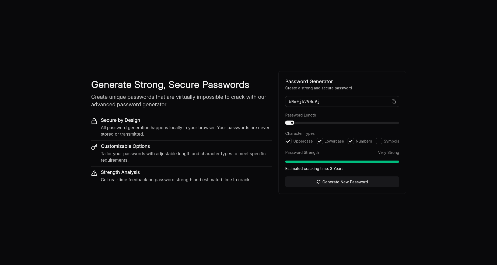

# 🔑 Password Generator

Generate strong, secure passwords with this modern, browser-based password generator tool. Built with Vue 3 and TypeScript, this application provides a user-friendly interface for creating customizable passwords with real-time strength analysis.



## ✨ Features

- **Secure by Design**: All password generation happens locally in your browser. Your passwords are never stored or transmitted.
- **Customizable Options**: Tailor your passwords with adjustable length and character types (uppercase, lowercase, numbers, symbols) to meet specific requirements.
- **Strength Analysis**: Get real-time feedback on password strength and estimated time to crack using the zxcvbn library.

- **Modern UI**: Clean, responsive interface built with Vue 3, TypeScript, and Tailwind CSS.

## 🚀 Getting Started

### Prerequisites

- Node.js (recommended v22.14.0)
- npm or yarn or pnpm

### Installation

1. Clone the repository:

   ```bash
   git clone https://github.com/pyyupsk/passgen.git
   cd papassgen
   ```

2. Install dependencies:

   ```bash
   npm install
   # or
   yarn install
   # or
   pnpm install
   ```

3. Start the development server:

   ```bash
   npm run dev
   # or
   yarn dev
   # or
   pnpm dev
   ```

4. Open your browser and navigate to `http://localhost:5173`

## 🛠️ Tech Stack

- **Frontend Framework**: Vue 3 with Composition API
- **Language**: TypeScript
- **Styling**: Tailwind CSS
- **Components**: Shadcn/UI (Vue)
- **Password Strength**: zxcvbn-ts

## 📊 Password Strength Rating

The application uses the zxcvbn library to calculate password strength:

- **Very weak**: Easily crackable in seconds
- **Weak**: Crackable in minutes to hours
- **Medium**: Crackable in days to months
- **Strong**: Crackable in years
- **Very strong**: Virtually impossible to crack with current technology

## 🔧 Customization

### Character Sets

You can include any combination of:

- Uppercase letters (A-Z)
- Lowercase letters (a-z)
- Numbers (0-9)
- Special symbols (!@#$%^&\*()\_+-=[]{}|;:,.<>?/)

### Password Length

Adjust the password length from 8 to 100 characters using the slider or number input.

## 📱 Responsive Design

The application is fully responsive and works on:

- Desktop computers
- Tablets
- Mobile phones

## 🤝 Contributing

Contributions are welcome! Please feel free to submit a Pull Request.

1. Fork the repository
2. Create your feature branch (`git checkout -b feature/amazing-feature`)
3. Commit your changes (`git commit -m 'feat: add amazing feature'`)
4. Push to the branch (`git push origin feature/amazing-feature`)
5. Open a Pull Request

## 📄 License

This project is licensed under the [MIT License](LICENSE) - see the LICENSE file for details.

## 🙏 Acknowledgements

- [zxcvbn-ts](https://github.com/zxcvbn-ts/zxcvbn) for password strength estimation
- [Lucide Icons](https://lucide.dev/) for beautiful icons
- [VueUse](https://vueuse.org/) for useful Vue 3 composables
- [Tailwind CSS](https://tailwindcss.com/) for styling

---

Built with ❤️ by [pyyupsk](https://github.com/pyyupsk)
